# MANUAL DE USUARIO

## Introducción
El siguiente manual tiene como fin introducir al usuario al manejo y conocimiento de REGEXIVE para su uso funcional.  

### __TytusDB__

REGEXIVE es una aplicación que permite crear un sistema capaz de realizar el Método del Árbol y el Método de Thompson, para que los estudiantes puedan verificar que las respuestas de las tareas y exámenes del curso son correctas, así como validar cadenas. Por medio de una interfaz gráfica para el manejo de operaciones y reportes.

El software desarrollado cuenta con dos distintas ventanas de opciones para que el usuario pueda interactuar y hacer uso de la misma, las cuales se detallan más adelante.
  

### Requerimientos del sistema

Cualquier computadora con sistema operativo Windows (8+) con máquina virtual de Java instalada para correr un .jar y 1 GB de memoria RAM como mínimo.
  

## Ventana principal

  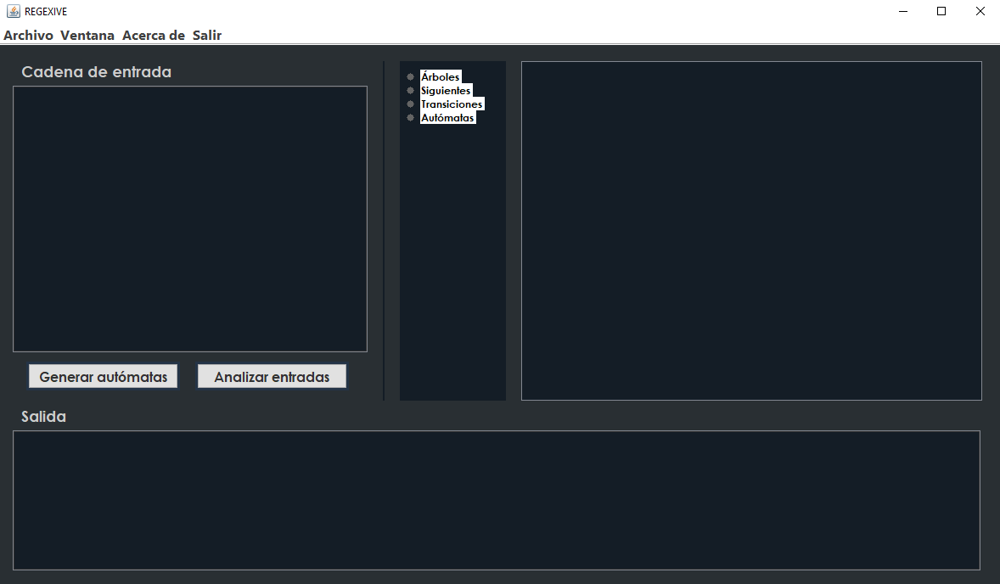

En ella el usuario puede acceder a cada una de las funcionalidades de la aplicación y visualizar los reportes según desee.

  

  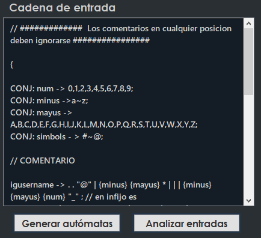

Panel de texto donde el usuario podrá ingresar sus archivos .olc o bien escribir uno desde cero.
  

  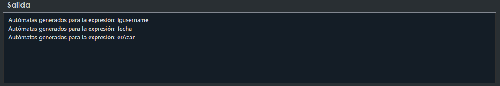

Consola de salida donde se brindará una pequeña retroalimentación de los procesos completados e información de errores.
  

  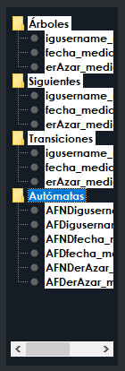

Árbol de archivos para que el usuario pueda desplegar sobre el panel las distinas imágenes de reportes.
Con un clic desplegará en el panel, y con doble clic se abrirá un archivo .svg con mayor calidad en su explorador predeterminado.
  

  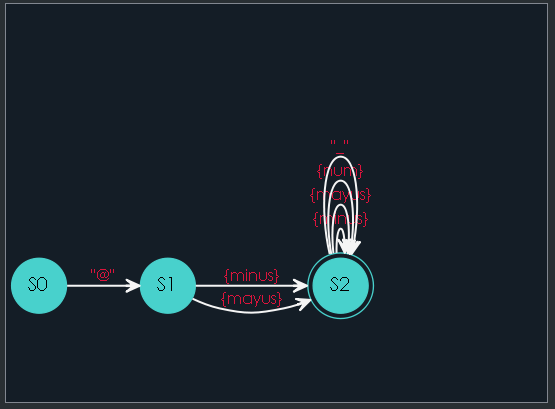

Panel de imágenes para poder visualizar los reportes que el usuario elija del árbol de archivos en formato.png.
  

  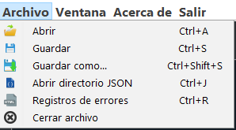

Menú para poder elegir distintas opciones y su respectivo atajo en teclado.
  

## Funciones

### Generar autómatas
Al hacer clic en este botón se realizará un análisis inicial para generar cada uno de los autómatas (AFND y AFD), así como un árbol de expresiones y todos sus componentes como tabla de siguientes y transiciones.
  

### Analizar entradas
Se realizará un segundo análisis para poder validar entradas ingresadas por el usuario y reportar todas en un sólo archivo .json en el que podrá acceder desde el menú o presionando Ctrl+J.

 

### Manejo de errores:

Es frecuente que puedan ocurrir ciertos errores al momento de ingresar datos y manejar las funciones del administrador, para ello se le retornará un archivo html con todos los errores tanto léxicos como sintácticos para informar sobre el error.

  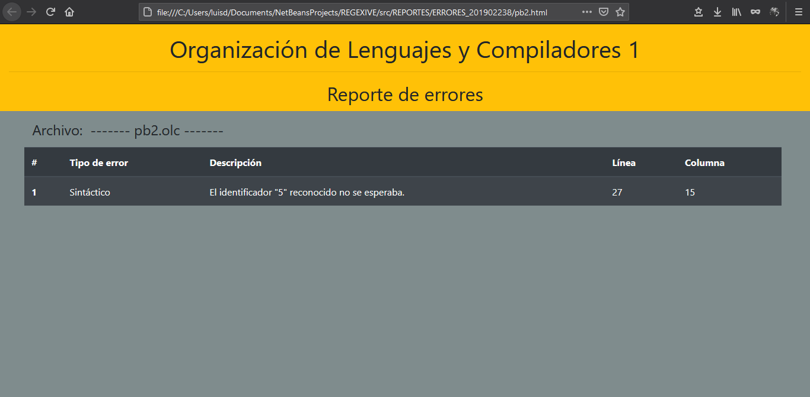

Cada error detalla en qué linea y columna se presentó, así como si se trata de un error léxico (no pertence al lenguaje) o sintáctico (el orden no fue el correcto).

  

## Sintaxis esperada:
El archivo para la definición de las expresiones regulares se compone de una sección en la que cada sentencia define el token (identificador) con que el analizador debe reconocer los lexemas ingresados, seguido de la definición de la expresión regulares. Seguido de esto dos símbolos de porcentaje (%%). Por último, se define un identificador y un lexema de entrada, el cual se deberá comparar con la definición que se encuentra en la parte superior.
 
Cada sentencia se delimita utilizando punto y coma.
  

**Expresiones regulares:**
Las expresiones regulares establecen el patrón que se debe cumplir para representar un token, estas se reconocerán en notación polaca o prefija.

  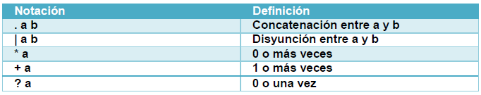

  

**Conjuntos:**
Para la definición de conjuntos se utiliza la palabra reservada “CONJ”. Un conjunto puede utilizarse dentro de una expresión regular, pero no en la definición de otro conjunto.
A continuación, la notación a utilizar para la definición de conjuntos:

  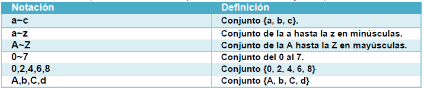

*Los conjuntos vistos anteriormente son ejemplos de las diferentes variantes que éstos pueden tomar (Ej: también puede existir a~d o 0~9).
  

**Caracteres especiales:**
Dentro del lenguaje pueden utilizarse estos caracteres especiales:

  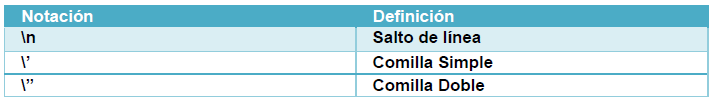

  

**Notas:**
- La definición de conjuntos CONJ puede existir en cualquier parte del archivo.
- El uso de conjuntos se verá delimitado por { llaves }

## Ejemplo de archivo de entrada válido:

  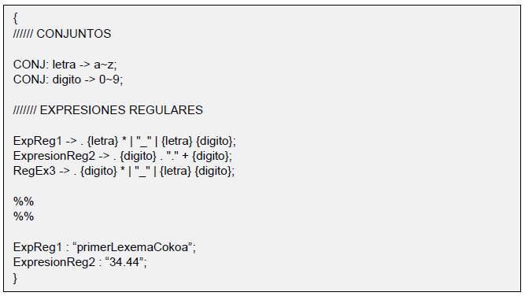

  

## Soporte técnico

luis.danniel@hotmail.com